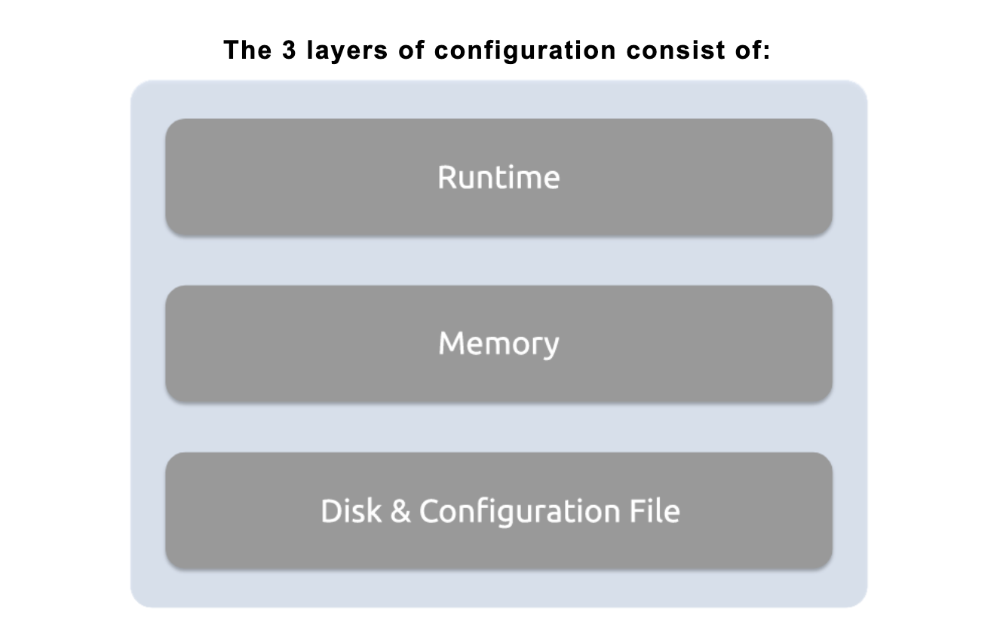
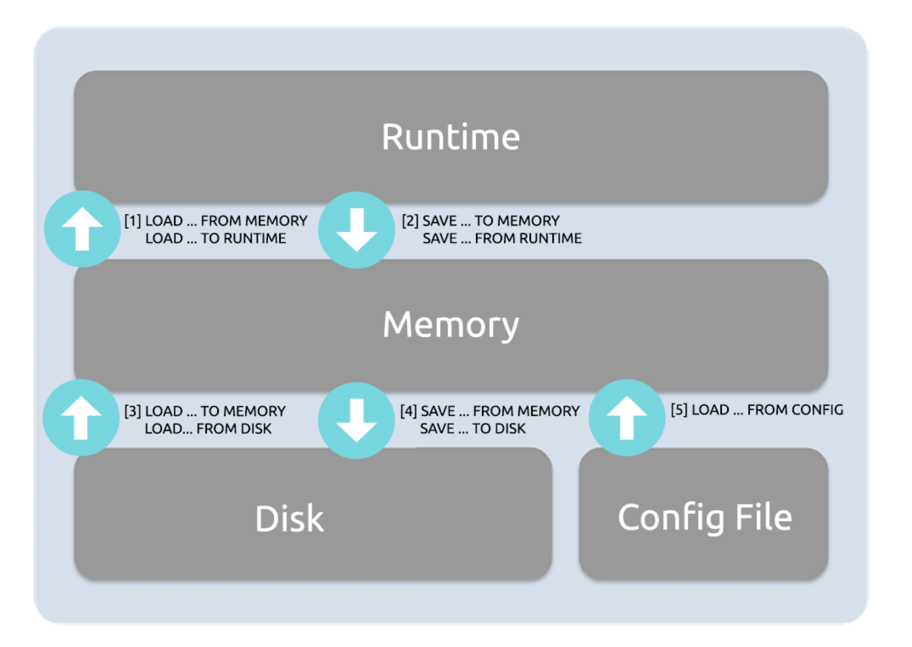

# 多层配置系统

    ProxySQL有一个高级但直观的配置系统，用于促进：
    
    * 易于使用的动态运行时配置系统，确保零停机更改
    * 轻松地将配置回滚到以前的状态
    * 与MySQL兼容的管理接口
    
    这是通过多层配置系统实现的，在该系统中，设置从运行时移动到内存，并根据需要持久化到磁盘。

    * RUNTIME
    * MEMORY
    * DISK
    

### RUNTIME

    RUNTIME运行时层表示处理请求的工作线程所使用的ProxySQL的内存中数据结构。
    runtime运行时变量包含与以下内容相关的配置：
    
    * 全局变量中定义的实际值
    * 分组为主机组的后端服务器列表
    * 可以连接到代理的MySQL用户列表
    
    注意：Operators操作员永远不能直接修改RUNTIME运行时配置部分的内容。

### MEMORY

    MEMORY（也称为main）层表示通过MySQL兼容接口公开的内存中数据库。用户可以将MySQL客户端连接到此界面，并view/edit各种ProxySQL配置表。
    
    通过此接口可用的配置表包括以下表：
    
    * mysql_servers -- ProxySQL连接到的后端服务器列表
    * mysql_users -- 连接到ProxySQL的用户及其凭据的列表。请注意，ProxySQL也将使用相同的凭据连接到后端服务器！
    * mysql_query_rules -- 将流量路由到各种后端服务器时评估的查询规则列表。这些规则还可以重写查询，甚至缓存已执行查询的结果。
    * global_variables -- 代理配置为使用的全局变量列表，可以在运行时进行调整。
    
    全局变量示例：
    mysql> select * from global_variables limit 3;
    +----------------------------------+----------------+
    | variable_name                    | variable_value |
    +----------------------------------+----------------+
    | mysql-connect_retries_on_failure | 5              |
    | mysql-connect_retries_delay      | 1              |
    | mysql-connect_timeout_server_max | 10000          |
    +----------------------------------+----------------+

    * mysql_collations -- 可供代理使用的MySQL排序规则列表。这些文件直接从客户端库中提取。
    * [仅在调试版本中可用] debug_levels -- ProxySQL发出的调试语句类型列表及其详细级别，仅在调试版本中可用，因为它会影响性能。
    
### DISK 和 CONFIG FILE

    DISK层表示磁盘上的SQLite3数据库，默认位置为/var/lib/proxysql/proxysql.db。
    磁盘数据库可在内存中持久化并配置为磁盘，以便在ProxySQL重新启动后配置可用。
    CONFIG文件是经典的配置文件，我们将在下一节中看到它与其他配置层之间的关系。

## 配置生命周期

    在启动期间，ProxySQL读取其配置文件（如果存在）以确定定义的datadir，然后尝试在指定路径中定位其内部数据库文件。
    * 如果在指定的datadir中找到数据库，则ProxySQL将从持久化的磁盘数据库初始化其内存中的配置，也就是说，磁盘配置将加载到MEMORY中，并传播到RUNTIME时。
    * 如果找不到数据库文件（例如，在第一次运行ProxySQL或数据库已被删除的情况下），将解析配置文件，并将其内容加载到内存中，保存到磁盘数据库，并传播到RUNTIME时。
    
    重要提示：如果找到数据库文件，则不会解析/etc/proxysql.cnf配置文件，即proxysql仅从持久化的磁盘数据库初始化其内存中的配置，
    除非它不存在，在这种情况下，它将回退到配置文件。

### 初始启动（或--initial标志）

    如前所述，在ProxySQL的第一次启动期间，内存和运行时配置将从配置文件中填充，
    此后所有持久化配置都存储在ProxySQL的内部数据库中。
    
    通过使用--initial标志运行proxysql，可以强制重新进行初始配置，
    这将使SQLite数据库文件重置为其原始状态（即配置文件中定义的状态），
    并在需要回滚时重命名现有SQLite数据库文件（如果需要，请检查旧文件的定义数据目录）。

### 重新加载启动（或--reload标志）

    如果使用--reload标志执行ProxySQL二进制文件，它将尝试将配置文件中的配置与数据库文件的内容合并。
    此后，它将使用新合并的配置启动。

    无法保证ProxySQL在发生冲突时能够成功合并两个配置源，用户应始终验证合并是否按预期执行。

### Runtime运行时ProxySQL配置

    在运行时修改配置是通过ProxySQL的ProxySQL管理端口完成的（默认情况下为6032）。
    在使用兼容MySQL的客户端连接到它之后，您将看到一个标准的MySQL风格的界面，用于查询各种底层ProxySQL配置和统计表：

    ProxySQL Admin> show tables;
    +----------------------------------------------------+
    | tables                                             |
    +----------------------------------------------------+
    | global_variables                                   |
    | mysql_aws_aurora_hostgroups                        |
    | mysql_collations                                   |
    | mysql_firewall_whitelist_rules                     |
    | mysql_firewall_whitelist_sqli_fingerprints         |
    | mysql_firewall_whitelist_users                     |
    | mysql_galera_hostgroups                            |
    | mysql_group_replication_hostgroups                 |
    | mysql_query_rules                                  |
    | mysql_query_rules_fast_routing                     |
    | mysql_replication_hostgroups                       |
    | mysql_servers                                      |
    | mysql_users                                        |
    | proxysql_servers                                   |
    | restapi_routes                                     |
    | runtime_checksums_values                           |
    | runtime_global_variables                           |
    | runtime_mysql_aws_aurora_hostgroups                |
    | runtime_mysql_firewall_whitelist_rules             |
    | runtime_mysql_firewall_whitelist_sqli_fingerprints |
    | runtime_mysql_firewall_whitelist_users             |
    | runtime_mysql_galera_hostgroups                    |
    | runtime_mysql_group_replication_hostgroups         |
    | runtime_mysql_query_rules                          |
    | runtime_mysql_query_rules_fast_routing             |
    | runtime_mysql_replication_hostgroups               |
    | runtime_mysql_servers                              |
    | runtime_mysql_users                                |
    | runtime_proxysql_servers                           |
    | runtime_restapi_routes                             |
    | runtime_scheduler                                  |
    | scheduler                                          |
    +----------------------------------------------------+

    每个这样的表在管理界面中都有一个定义良好的角色，有关每个表的更多信息可以在main（runtime）(https://proxysql.com/documentation/main-runtime/)模式文档中找到。

    这些表表示上图中描述的内存中数据库，可以使用标准SQL查询进行配置。
    为了将配置从该层向上移动（即，为了在运行时使用）或向下移动（为了持久化到磁盘），请查看下一节。

### 在层之间移动配置

    为了将配置持久化到磁盘或将配置加载到运行时，有一组不同的管理命令可用，可通过管理界面对每个配置项执行这些命令，
    例如mysql servers、mysql users、mysql query rules

    以下命令语法可用于在各个层之间移动ProxySQL配置，<item>是要配置的配置项的占位符：
    
    * [1] `LOAD <item> FROM MEMORY`/ `LOAD <item> TO RUNTIME`
        * 将配置项从内存数据库加载到运行时数据结构
    
    * [2] `SAVE <item> TO MEMORY` / `SAVE <item> FROM RUNTIME`
        * 将配置项从运行时保存到内存中的数据库
    
    * [3] `LOAD <item> TO MEMORY` / `LOAD <item> FROM DISK`
        * 将持久化配置项从磁盘数据库加载到内存数据库
    
    * [4] `SAVE <item> FROM MEMORY` / `SAVE <item> TO DISK`
        * 将配置项从内存数据库保存到磁盘数据库
    
    * [5] `LOAD <item> FROM CONFIG`
        * 将配置项从配置文件加载到内存中的数据库中

**重要注意事项：** 只有将更改加载到运行时才会激活，并且在ProxySQL重新启动后，任何未保存到磁盘的更改都将不可用。

常见配置项的示例命令可以在下面找到（这不是一个完整的列表）：

**激活/持久化MySQL用户:**

    # Active current in-memory MySQL User configuration
    LOAD MYSQL USERS TO RUNTIME;
    
    # Save the current in-memory MySQL User configuration to disk
    SAVE MYSQL USERS TO DISK;

**激活/持久化MySQL服务器和MySQL复制主机组:**

    # Active current in-memory MySQL Server and Replication Hostgroup configuration
    LOAD MYSQL SERVERS TO RUNTIME;
    
    # Save the current in-memory MySQL Server and Replication Hostgroup configuration to disk
    SAVE MYSQL SERVERS TO DISK;

**激活/持久化MySQL查询规则:**

    # Active current in-memory MySQL Query Rule configuration
    LOAD MYSQL QUERY RULES TO RUNTIME;
    
    # Save the current in-memory MySQL Query Rule configuration to disk
    SAVE MYSQL QUERY RULES TO DISK;

**激活/持久化MySQL变量:**

    # Active current in-memory MySQL Variable configuration
    LOAD MYSQL VARIABLES TO RUNTIME;
    
    # Save the current in-memory MySQL Variable configuration to disk
    SAVE MYSQL VARIABLES TO DISK;

**激活/持久化MySQL管理变量:**

    # Active current in-memory ProxySQL Admin Variable configuration
    LOAD ADMIN VARIABLES TO RUNTIME;
    
    # Save the current in-memory ProxySQL Admin Variable configuration to disk
    SAVE ADMIN VARIABLES TO DISK;

**注意：以上命令允许以下快捷方式：**

    * MEM for MEMORY
    * RUN for RUNTIME
    
    例如，这两个命令是等效的：
    * `SAVE ADMIN VARIABLES TO MEMORY`
    * `SAVE ADMIN VARIABLES TO MEM`

## 故障排除

    请注意，只有在将值加载到运行时时，才会进行最终验证。您可以设置一个值，该值在保存到内存或甚至保存到磁盘时不会引发任何类型的警告或错误。
    但是，在执行加载到运行时时时，更改会恢复到以前保存的状态。
    如果发生这种情况，您应该检查定义的错误日志。
    例如:
    [WARNING] Impossible to set variable monitor_read_only_interval with value "0". Resetting to current "1500".
    

